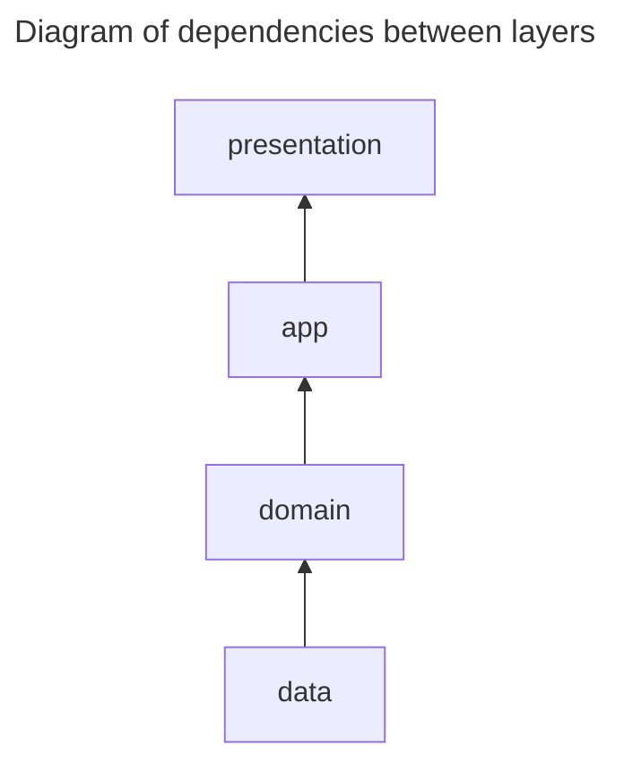

# flutter_template

## Project description

Flutter template project for android, ios and web. You can generate a new repository by clicking
"**Use this template**" above.

## Setup and Installation

### Bootstrap the project

```bash
echo "Bootstrap the project"
clear 
flutter clean 
flutter pub get 
dart run build_runner build --delete-conflicting-outputs 
dart run intl_utils:generate
echo "Bootstrap finished"
```

## Gen code

Watches the files system for edits and does rebuilds as necessary.

```bash
dart run build_runner watch
```

## Structure folder

[//]: # (```)

[//]: # (📦lib)

[//]: # ( ┣ 📂app &#40;App layer&#41;)

[//]: # ( ┃ ┣ 📂bloc: contains Bloc used on multiple pages)

[//]: # ( ┃ ┃ ┣ 📂auth: bloc supports authentication)

[//]: # ( ┃ ┃ ┃ ┣ 📜auth_bloc.dart)

[//]: # ( ┃ ┃ ┃ ┣ 📜auth_event.dart)

[//]: # ( ┃ ┃ ┃ ┗ 📜auth_state.dart)

[//]: # ( ┃ ┃ ┗ 📂base: contains boilerplate bloc)

[//]: # ( ┃ ┃ ┃ ┣ 📂common: bloc which manage loading status, exception, message on pages)

[//]: # ( ┃ ┃ ┃ ┣ 📜base_bloc.dart)

[//]: # ( ┃ ┃ ┃ ┣ 📜base_bloc_event.dart)

[//]: # ( ┃ ┃ ┃ ┗ 📜base_bloc_state.dart)

[//]: # ( ┃ ┃ ┗  ...)

[//]: # ( ┃ ┣ 📂injector: support DI)

[//]: # ( ┃ ┗ 📂navigation: manage application navigation)

[//]: # ( ┣ 📂data &#40;Data layer&#41;: )

[//]: # ( ┃ ┣ 📂data_sources: query data from API, database, ...)

[//]: # ( ┃ ┣ 📂mappers: supports map data between models &#40;of data layer&#41; and entities &#40;of domain layer&#41; and )

[//]: # ( ┃ ┣ 📂models: contains the data used in data_source)

[//]: # ( ┃ ┣ 📂repositories: used for accessing and manipulating data )

[//]: # ( ┃ ┗ 📂session: manages the user's current login session)

[//]: # ( ┣ 📂domain &#40;Domain layer&#41;)

[//]: # ( ┃ ┣ 📂entities)

[//]: # ( ┃ ┗ 📂repositories: provide an abstraction layer)

[//]: # ( ┣ 📂gen: contains automatically generated files)

[//]: # ( ┣ 📂l10n: contains multilingual files)

[//]: # ( ┃ ┣ 📂generated)

[//]: # ( ┃ ┣ 📜intl_en.arb)

[//]: # ( ┃ ┗ 📜intl_vi.arb)

[//]: # ( ┣ 📂presentation &#40;Presentation layer&#41;)

[//]: # ( ┃ ┣ 📂common_widgets: contains widgets that are common to the entire application)

[//]: # ( ┃ ┗ 📂pages: Each page of app is a folder)

[//]: # ( ┃ ┃ ┣ 📂home)

[//]: # ( ┃ ┃ ┃ ┣ 📂bloc)

[//]: # ( ┃ ┃ ┃ ┃ ┣ 📜home_bloc.dart)

[//]: # ( ┃ ┃ ┃ ┃ ┣ 📜home_event.dart)

[//]: # ( ┃ ┃ ┃ ┃ ┗ 📜home_state.dart)

[//]: # ( ┃ ┃ ┃ ┣ 📂models)

[//]: # ( ┃ ┃ ┃ ┣ 📂widget)

[//]: # ( ┃ ┃ ┃ ┃ ┣ 📜home_body.dart)

[//]: # ( ┃ ┃ ┃ ┃ ┣ 📜home_tab_view_one.dart)

[//]: # ( ┃ ┃ ┃ ┃ ┣ 📜home_tab_view_three.dart)

[//]: # ( ┃ ┃ ┃ ┃ ┗ 📜home_tab_view_two.dart)

[//]: # ( ┃ ┃ ┃ ┗ 📜home_page.dart)

[//]: # ( ┣ 📂shared: contains utilities, error definitions, application resources, constants, extensions ...)

[//]: # ( ┃ ┣ 📂constants)

[//]: # ( ┃ ┃ ┗ 📜constants.dart)

[//]: # ( ┃ ┣ 📂exceptions)

[//]: # ( ┃ ┃ ┣ 📜app_exception.dart)

[//]: # ( ┃ ┣ 📂extensions)

[//]: # ( ┃ ┃ ┣ 📜number_extension.dart)

[//]: # ( ┃ ┣ 📂logger)

[//]: # ( ┃ ┃ ┗ 📜logger.dart)

[//]: # ( ┃ ┣ 📂mixins)

[//]: # ( ┃ ┣ 📂observers)

[//]: # ( ┃ ┃ ┣ 📜app_bloc_observer.dart)

[//]: # ( ┃ ┃ ┗ 📜app_navigator_observer.dart)

[//]: # ( ┃ ┣ 📂resources)

[//]: # ( ┃ ┃ ┣ 📂src)

[//]: # ( ┃ ┃ ┗ 📜resources.dart)

[//]: # ( ┃ ┣ 📂useful)

[//]: # ( ┃ ┗ 📂utils)

[//]: # ( ┣ 📜app.dart)

[//]: # ( ┗ 📜main.dart)

[//]: # (```)



## Troubleshooting

### Clear git local cached

When you think your git is messed up, you can use this command to do everything up-to-date.

```bash
git rm -r --cached . 
git add . 
git commit -m 'git cache cleared'
```

> [!CAUTION]
> Note: Only use when the project has no changes waiting to be committed.

### Markdown bash/shell scripts run in reverse order on Windows

- How to
  fix: https://youtrack.jetbrains.com/issue/IDEA-294997/Markdown-shell-scripts-run-in-reverse-order