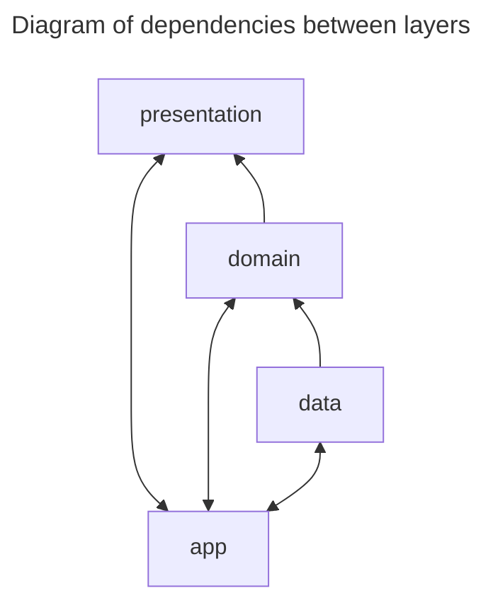

# flutter_template

## Project description

Flutter template project for Android and Ios. You can generate a new repository by clicking
"**Use this template**" above.

## Version

- Flutter 3.27.1
- Dart 3.6.0
- Java JDK 17

## Setup and Installation

### Bootstrap the project

- Run each command below in turn

```bash
flutter clean
```

```bash
flutter pub get 
```

```bash
dart run build_runner build --delete-conflicting-outputs 
```

```bash
dart run intl_utils:generate
```

## Gen code

Watches the files system for edits and does rebuilds as necessary.

```bash
dart run build_runner watch
```



## Troubleshooting

### Clear git local cached

When you think your git is messed up, you can use this command to do everything up-to-date.

```bash
git rm -r --cached . 
git add . 
git commit -m 'git cache cleared'
```

> [!CAUTION]
> Note: Only use when the project has no changes waiting to be committed.

## Tools

- [DartJ](https://dartj.web.app/) is Flutter application, maked by @ttpho, which will generate the
  Freezed classes from a JSON payload.
